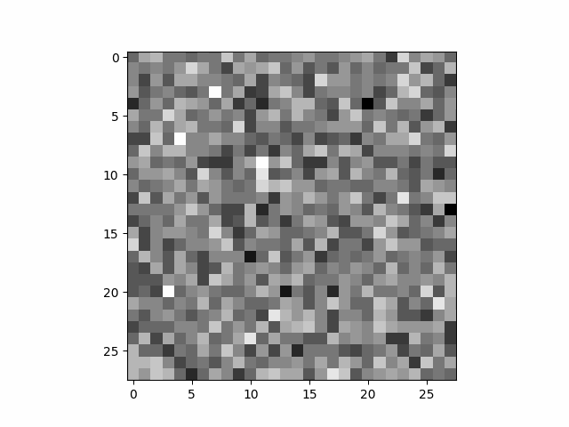

# Federated DDPM (PyTorch)

## Requirements

All the code in this repository is based on PyTorch version `v1.13.1`.
Be aware when installing PyTorch that you **don't** install version 2.
The code should work in both CPU as well as CUDA GPU.

NOTE: This code is only tested on Ubuntu 20.04

* Python3.8
* pip

Install all the packages from requirements.txt

```bash
pip install -r requirements.txt 
```

## Data

* Train and test datasets will be automatically downloaded from torchvision datasets.
* Experiments are run on Fashion MNIST, CIFAR-10 and CelebA.

## Running the troublesome experiments

* To run the federated experiment with CelebA, which throws a CUDA out of memory:

```
python src/federated_diffusion.py --dataset=celeba --train=1 --image_size=256
```

* To show the inaccurate samples created for CIFAR-10:

```
python src/federated_diffusion.py --dataset=cifar --train=0 --image_size=32 --conditional=1 --color=0
```

* To show the accurate samples created for Fashion MNIST:

```
python src/federated_diffusion.py --dataset=fmnist --train=0 --color=0 --image_size=28 --conditional=1
```

# Just run

```
python src/federated_diffusion.py
```

The default values for various parameters parsed to the experiment are  given in ```options.py```.


## Options

#### Federated Parameters

* ```--rounds:```   The number of global training rounds. Default set to 5.
* ```--num_users:```Number of users. Default set to 2.
* ```--frac:```     Fraction of users to be used for federated updates. Default is 1.
* ```--local_ep:``` Number of local training epochs in each user. Default is 3.
* ```--local_bs:``` Batch size of local updates in each user. Default is 128.

#### Diffusion Parameters

* ```--train:```      Whether to retrain the model (1) instead of loading the checkpointed version (0). Default set to 1.
* ```--time_steps:``` Number of time steps used in the diffusion proces. Default set to 1000.
* ```--conditional:```Whether the model is class labeled (1) or not (0). Default set to 0.      
* ```--lr:```         The learning rate for local updates. Default set to 1e-4. 
* ```--momentum:```   SGD momentum. Default set to 0.5  
* ```--optimizer:```  The type of optimizer used for local updates. Options are 'adam' and 'sgd'. Default set to 'adam'. 

#### Data Parameters

* ```--dataset:```   The dataset to train on. Options are 'celeba', 'fmnist' and 'cifar'. Default set to 'celeba'. 
* ```--image_size:```The squared dimensions of the images. Default set to 32.
* ```--color:```     Whether the images are greyscale (0) or color (1). Default set to 1.
* ```--iid:```       whether to use i.i.d data (1) or not (0). Default set to 1.
* ```--unequal:```   Whether to use unequal data splits (1) for non-i.i.d setting or not (1). Default set to 0.

#### Export/Sampling Parameters

* ```--export_samples:```the number of generated samples to export. Default set to 0.
* ```--export_dataset:```the number of training samples to export. Default set to 0.
* ```--show_samples:```  whether to show some test samples (1) or not (0). Default set to 1.

